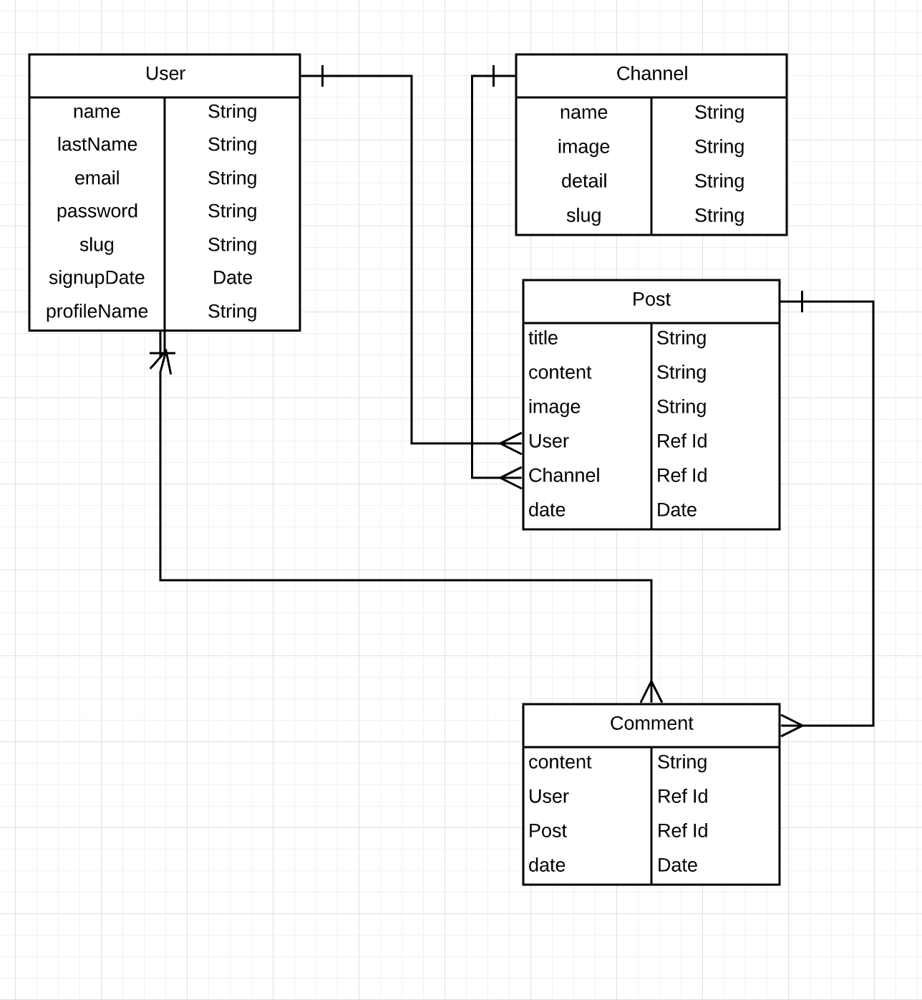
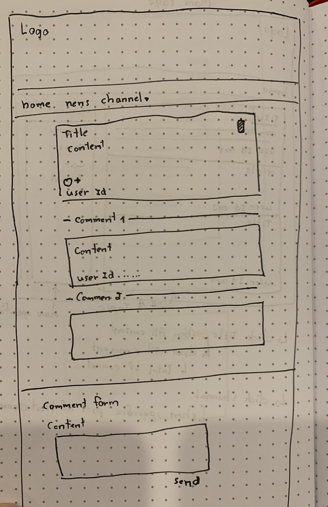

## Write-It

In the project directory, you can run:

### About 
- Write-It is social Blog with different communities that users can join. In these communities, users can create posts to share their experiences with other users or comment on other user's posts. The goal of this site is to create an online community for users to share their interests and ideas.

## Data Base Chart

### Wireframe :

### Project :
https://fathomless-escarpment-12751.herokuapp.com
### Scope : 
https://docs.google.com/document/d/1MHM0yUAD5a4YymbfHaHQsuVMXIFw37IsY4p9Lqk3t0I/edit
### Wireframe : 
https://www.lucidchart.com/documents/edit/3d9b25b7-7984-4259-965c-125713754eb3/0_0?beaconFlowId=FB7F8885D47526CB

---
### Tech :
React, JavaScript, HTML/CSS
